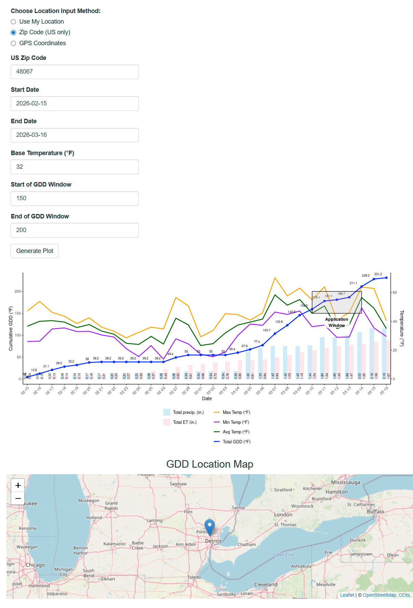

# SunTally

[🔗 Launch Live App: Click here to open SunTally](https://adwinters.shinyapps.io/sun-tally/)

SunTally is an interactive Shiny web app designed for turfgrass professionals, including lawn care operators and sports turf managers, to monitor and forecast growing degree days (GDD), temperature, rainfall, and evapotranspiration (ET) for any location. Users can quickly access weather data by using their browser’s location, entering a U.S. ZIP code, or inputting GPS coordinates, and the app visualizes daily high, low, and average temperatures alongside cumulative GDD, rainfall, and ET. This unified plot helps optimize the timing of pre-emergent herbicide or plant growth regulator applications by highlighting GDD windows, while also providing clear insights into weather trends and plant growth conditions.

---

## Features

- Supports location input via browser geolocation, U.S. ZIP code, or GPS coordinates  
- Visualizes daily high, low, and average temperatures  
- Tracks cumulative GDD, rainfall, and evapotranspiration (ET)  
- Highlights GDD windows for optimized application timing  
- Interactive map for location

---

## Built With

- [R](https://www.r-project.org/)  
- [Shiny](https://shiny.rstudio.com/)  
- [shinyjs](https://deanattali.com/shinyjs/) for interactivity  
- [ggplot2](https://ggplot2.tidyverse.org/) for plotting  
- [leaflet](https://rstudio.github.io/leaflet/) for maps  
- [Open-Meteo API](https://open-meteo.com/) for weather and GDD data  

---

